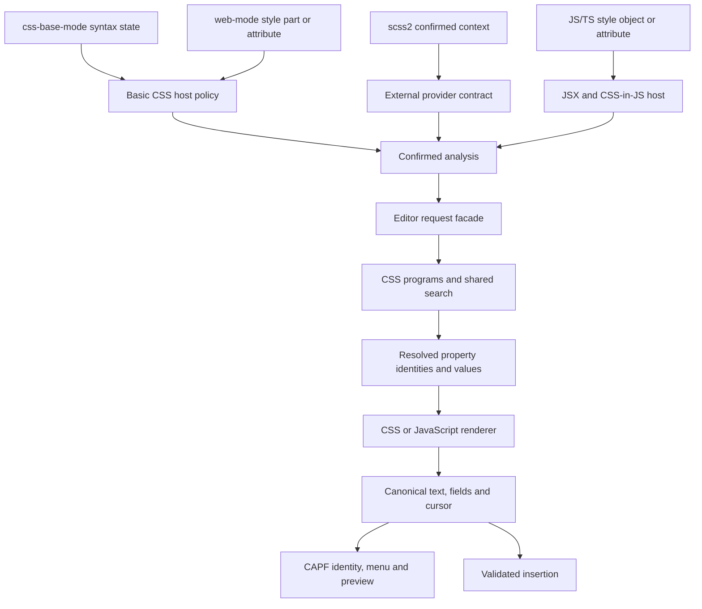

# Architecture

The package has three layers: a host confirms where an abbreviation may be
used, a pure language pipeline produces a result, and the editor presents or
inserts that result. Runtime files stay at the package root so ordinary Emacs
load paths and package recipes discover every library. Public contracts are in
[API.md](API.md); this document describes how the modules divide the work.

## Terms

- **Host**: the code that decides whether point is in an Emmet position: a
  built-in adapter (CSS, Web or JS) or the buffer's `emmet2-context-provider`.
  On explicit request, other major modes are treated as plain markup.
- **Built-in CSS**: a `css-base-mode` buffer without a provider. CSS embedded in
  web-mode uses the same adapter but follows the explicit rules on explicit
  requests.
- **Analysis**: the plist from `emmet2-context-analyze`: `:beg`, `:end`,
  `:abbr`, `:lang`, `:syntax` and `:position`, plus any `:at-rule`, `:property`
  or `:indent-width`. A *confirmed* analysis is one a host returned and
  `emmet2-context` validated against the visible buffer.
- **Canonical result**: the plist from `emmet2-result-create`: `:text`,
  `:fields` as `(BEG END GROUP DEFAULT)` with zero-based character offsets, and
  `:cursor`.
- **Call-owned**: created for one expansion and never kept after it, except
  inside the returned result.
- **Context revision**: the value of `emmet2-context-revision`. While it stays
  `equal`, the analysis it was computed with is reused.
- **Input revision**: the analysis, insertion snapshot and choices a completion
  table currently answers for.
- **Batch**: the plist from `emmet2-expand-choices`: `:choices`, each a plist of
  `:abbreviation`, `:result`, `:label` and `:query`, and for CSS an opaque
  `:prefix`.
- **Choice identity**: the `emmet2--choice` text property that ties a
  candidate string to one choice of one input revision.
- **Program, reading**: a CSS program is the list of property readings one
  choice expands to; a reading is a resolved property name with its value
  source, either authored text or a search keyword kept verbatim, and an
  importance flag.
- **Confirmed prefix**: in a CSS property list such as `ovh,ta`, everything
  before the last top-level comma or plus.
- **Admission**: the check that decides whether a request offers choices at
  all (`emmet2-capf--admit`). A bare CSS word passes only when its first batch
  has a choice.

## Module groups

| Group | Modules | Responsibility |
| --- | --- | --- |
| Host entry | `emmet2-context.el` | Route to one host, validate every confirmed analysis against the restored visible view, expose the context revision. |
| Basic CSS host | `emmet2-context-css.el` | Use CSS Base syntax state and a small insertion-position policy. Also analyze bounded CSS supplied by the Web host. |
| HTML and embedded languages | `emmet2-context-web.el` | Flush web-mode scanning and route HTML, style attributes, CSS and JS parts; own its pending bounded CSS scan. |
| JSX and style objects | `emmet2-context-js.el` | Confirm JSX or CSS-in-JS objects of the configured style attributes and functions using original and projected JS trees; own those options, parser lifetimes and unit markers. |
| Extraction | `emmet2-extract.el` | Find balanced abbreviation bounds inside the host's range; recognize pseudo-chain boundaries without editor state. |
| HTML / JSX expansion | `emmet2-engine-markup.el` | Parse one markup AST, apply one HTML/React/Solid profile, then render. |
| CSS expansion | `emmet2-css.el`, `emmet2-engine-stylesheet.el` | Resolve choices, completion fragments and project rules; resolve property identities and authored values into declarations. The renderer emits CSS or JavaScript directly from those declarations. |
| Shared results and public policy | `emmet2-engine.el`, `emmet2-extensions.el` | Canonical text/field/cursor operations, deadline, engine dispatch and stable public expansion entries. |
| Data and matching | `emmet2-css-data.el`, `emmet2-css-search.el`, `emmet2-fuzzy.el` | Documented CSS names/values, abbreviation ranking, and general name matching/highlighting. |
| Semantic completion | `emmet2-completion.el`, `emmet2-css-value.el` | Shared name tables, fuzzy styles and function acceptance; adapt CSS Base value context to that shared path. |
| Editor requests | `emmet2-expand.el` | Own the expansion options and translate host analysis plus buffer layout into language requests. |
| Editor | `emmet2-mode.el`, `emmet2-capf.el`, `emmet2-preview.el`, `emmet2-insert.el` | Compose the package, own completion revisions, show previews, and accept results atomically. |
| Optional Corfu adapter | `emmet2-corfu.el` | For the `emmet2` category, advise Corfu's row formatting, popup anchor and exactness check; for every table emmet2 builds, spare row strings Corfu's line-break copy. Installed when an Emmet or semantic completion table is first built and removed on unload. |

## CSS entry paths

`scss2` owns its parser, dialect, scope and semantic completion dispatcher.
Its provider's decline is final: Emmet never falls back to the basic CSS host.
Both abbreviation entry paths call the same CSS choices and expansion code.
`scss2-expand` may intentionally insert a synchronous result; that is host
policy, not a second parser or renderer.

## Hosts and positions

`emmet2-context` routes to one host and validates what it confirms: supported
language/position pairs, visible integer bounds and the indentation width. It
reads `:abbr` from the source, so a provider never supplies the text, and copies
the plist without changing host state. Both host callbacks restore point,
narrowing and match data. The context entry coordinates start and stop and
exposes the analysis inputs; it stores no second parser inventory or analysis
cache. An external provider owns its syntax and confirmed bounds while
installed, until replaced or cleared by a major-mode change; Emmet keeps no
result cache, timer or parser for it. A provider installed before the mode is
enabled skips Emmet's parser warmup. Its contract is in
[API.md](API.md#host-completion-interface).

Basic CSS support uses `syntax-ppss` from CSS Base, without another CSS parser.
Every `css-base-mode` descendant, including `css-ts-mode`, is a CSS host. Basic
CSS permits property abbreviations only at declaration starts, excludes values,
comments, strings and arguments, and limits stylesheet-root expansion to
at-rules and pseudo selectors. A comment between declarations or a completed
nested block before point does not change the declaration-start position.

Embedded CSS needs a bounded lexical parse because web-mode's buffer syntax is
not CSS syntax. web-mode owns its pending scanner, attribute markers, part
ranges and engine blocks, which bound markup text; the Web adapter owns part
language, exclusive endpoints and the file or style dialect. Style parts parse
with CSS syntax, or SCSS syntax for `lang` `scss` or `less`. Context reports
`:syntax` `scss` for `scss-mode`, `<style lang="scss">` and standalone `.scss`
files in web-mode, otherwise `css`. Narrowed web buffers temporarily expose the
full host to its scanner and restore narrowing afterward; accepted
abbreviations must remain entirely visible. web-mode does not mark Astro
`{expression}` regions, so they are analyzed as markup (see the `astro {expr}`
case in `test/emmet2-context-lexical-test.el`).

JS, TS and JSX require the matching pinned tree-sitter grammar; HTML and CSS
paths need no additional grammar. Automatic requests use only an already warmed
parser and never create one, so cold JSX initialization needs an explicit
request. A missing grammar makes the CAPF return nil and explicit completion
report it. JS warmup consumes the same region discovery as ordinary analysis.
TSX error recovery must retain complete attached Emmet text while keeping
ordinary object and expression exclusions.

CSS classification starts at the extracted abbreviation, including when point
is inside a balanced raw value. Comments and strings are forbidden. Automatic
analysis also excludes values, at-rule preludes, ordinary selectors and
unrelated script expressions. A bare name and single colon at a declaration
start belong to a value position even without whitespace, unless the name is a
known HTML element, as in `button:hv`. Automatic top-level selectors need `@`,
`_`, a leading colon, or a structural selector prefix or known element with a
pseudo part. A known, custom or vendor property before the colon leaves the
value to the host.

Explicit requests skip the confidence check only outside built-in CSS. CSS
accepts declaration starts, at-rule names and selectors with a pseudo part, and
never values, at-rule preludes, arguments or Sass interpolation. On an explicit
request, embedded CSS also accepts an unknown name with a pseudo, such as
`my-el:hv`, as a selector. Built-in CSS uses the automatic position policy for
explicit requests too. Other major modes offer markup only on explicit request.

`emmet2-extract-css-pseudo` is the shared, buffer-independent boundary scan for
the trailing pseudo chain. Context, expansion classification and menu labels
use it instead of separate selector regular expressions. It skips escaped
colons, balanced attributes and function arguments, retaining authored selector
lists and combinators as a literal prefix. The `css-selector` extraction mode
recovers spaced headers on the current line within the host range. The host
then classifies that header from its start, so `color: .card:hv` stays a value.
Property lists such as `ovh,ta` keep their own comma handling and prefix reuse;
selectors never enter that path.

## Engines and results

`emmet2-engine` owns the canonical result and the shared expansion deadline.
Native cores return text, positive editable-field groups and an initial cursor,
using zero-based character offsets and half-open field intervals. They never
read or write an editor buffer. Loaded snippet and search index data is
read-only; ASTs, output, random state and name resolution are call-owned.

`emmet2-engine-expand` accepts `:preset` (`html`, `jsx`, `stylesheet`), literal
`:indent` and `:base-indent`, structured `:jsx` settings, `:at-rule` for
stylesheet descriptors and an integer `:seed`. The seed defaults to zero and its
low 32 bits drive call-local lorem generation; CSS ignores its value. Invalid
seed types fail for every preset, and global random state is never read or
modified. `emmet2-engine-with-expansion` gives nested calls one shared
one-second deadline, including lazy loading and transforms. Extensions wrap the
whole operation, so several CSS properties do not each receive a new budget.
Parse errors keep their message and character position; other failures use
`emmet2-error` subtypes. Failures and cancellation leave the source unchanged.

Markup keeps Emmet's mirrored fields. Emmet's `${0}` becomes an ordinary
editable field because insertion adds its own final exit. Conflicting defaults
of one index form independent groups, so a mirror never overwrites authored
text. CSS results give each empty value its own group; the groups stay in the
result but never become snippet fields.

JSX class conversion runs on the markup AST before formatting, because a
rendered class value cannot safely be recovered by regex. Literal class names
use dot access for identifiers and escaped bracket access otherwise. Fields
keep priority, mirrors and multiword expression spans, and whitespace-only
fields remain separate arguments. Authored class expressions are renamed for
React and Solid without interpretation. Project reference strings are emitted
as source, never evaluated.

## CSS expansion

`emmet2-css` owns CSS programs, property readings, completion choices,
fragment splitting, pending separators and the separator that joins
declaration results. A balanced scanner splits only top-level comma and plus
separators. Built-in aliases in `emmet2-css--aliases` (`posa`, `posf`, the
four-side `all`, `fwN`, `wf`/`hf`) produce several readings; search resolves
other compact names before their authored values are parsed. A resolved
property is never serialized back to an abbreviation for internal expansion,
and its name is kept through rendering.

The stylesheet engine parses authored values once and renders CSS or
JavaScript directly from declarations, including empty defaults, escaping and
field grouping; JavaScript never reparses CSS output. Field defaults,
whitespace omission, coincident fields and independent property groups are
handled while rendering. Bracketed raw values and `--name` variables are
emitted verbatim. Parenthesized steps such as `p(1)(2)` become function calls
only in SCSS with `:scale-functions`; otherwise they are parse errors.
CSS-in-JS chooses numbers, quoted values and keys from the declaration
structure, and emits escaping and field offsets together, without inspecting
CSS output.

The tokenizer recognizes a complete property name as the longest name in a set
that ends at a value boundary, as `margin-top` in `margin-top-10`. A regexp
alternation of every name would be evicted from Emacs's 20-entry regexp cache
and recompiled on every keystroke.

Completion receives full results with explicit fragment labels and matching
queries, so CAPF never reconstructs CSS syntax or layout. Property choices
never pass through the string-choice API: `emmet2-extensions-css-choices`
returns the same ranking as expandable strings for external callers, and CSS
completion uses it only for selector and at-rule choices, which are plain
names.

Pseudo and at-rule lookup applies authored aliases first, then fuzzy-ranks only
names that share the query's first letter, so `@us` cannot become
`@counter-style`. Without an authored alias, ranking alone resolves names: `@fa`
gives `@font-face`, not `@forward`, and `:fu` gives `:future`. Plain `css`
resolves names among CSS at-rules, directly or through an authored alias,
without Sass templates. Templates change only authored layout, leaving literal
tabs untouched. Only `:not` spreads comma arguments into chained calls. Pseudo
expansion produces selector names and editable function arguments only: it
keeps authored prefixes and creates no rule bodies or declarations, so hosts
need no rule-body permission or following-block checks.

In `emmet2-extensions-css` and completion, unknown at-rules, final pseudos,
properties, top-level value words and units signal `emmet2-parse-error`, so
nothing outside the data is offered. Bracketed values and unknown earlier
pseudos, as in `:global(.a):hv`, keep their spelling. The complete-name core
(`emmet2-engine-expand` with `:preset 'stylesheet`) keeps unknown words as
written.

## Search and matching

`emmet2-css-search` ranks properties and keywords over the compact pinned index
and the single immutable authored override catalog; CSS expansion reads
templates from that catalog through `emmet2-css-search-override`. Completion
and expansion both use it, and the stylesheet core receives complete property
names and never guesses one. Scores are fixnums, and each query owns its
tables. Loading shares equal strings, keyword entries and word vectors among
the index tables, which stay read-only. Each property records the letters and
digits of its name, so the in-order letter test rejects most properties
without scanning them.

Search aligns query segments with the words of a property and, for compact
queries, of one keyword value. A segment is a whole word, a word prefix, a
skeleton that keeps a word's letters in order from its initial, or an authored
word alias; an alias claims its letters for its own word. Each unmatched,
skipped inner or skipped leading word lowers the score. The pinned relevance of
the property and the size of the keyword's value set add a prior, so popularity
decides short queries while longer queries follow their words. Small sets that
are valid but rarely written, such as system colors, take a low fixed prior
instead; explicit queries such as `cCanvas` still reach them. Property aliases
rank first without hiding other choices. A complete property name longer than
one letter expands as typed and ranks first in completion, ahead of other
matches (`gap10` also offers `column-gap` and `row-gap`). Values combine a
property's own keywords, keywords reachable through its syntax and CSS-wide
keywords; function arguments and deprecated types are not values. Obsolete
properties stay complete names but are never offered. The frozen corpus in
`test/fixtures/css-search-corpus.json` and its gates in
`emmet2-css-search-test.el` guard these rules.

`emmet2-fuzzy` is original project code. Every query character consumes a
distinct candidate position, exact names and prefixes rank first, word initials
receive priority, and consecutive characters and smaller gaps improve the
remaining matches. Ties keep the first input item. Matches return both scores
and character positions, so the same matcher supplies menu highlighting and
host candidate ranking. Case folding keeps every character at its index, even
where special casing would lengthen a string, so positions always index the
candidate; each run of contiguous positions is highlighted as one face
interval. No fuzzy cache is needed.

## Completion

`emmet2-capf` owns admission, input revisions, fresh choice identities and
presentation. A small per-language confidence policy decides which automatic
requests offer choices; language modules build the choices. CAPF neither parses
CSS output nor reads splitter or search-index internals.

### Tables and revisions

A table holds an immutable input snapshot and its lazily computed choices.
Frontends query a table many times per keystroke; it classifies the host again
only when the context revision changes. The context module owns that value,
which lists every input of an analysis besides the hosts' own caches; add a new
input there, never a second cache in the table. A table also captures its
provider's identity and rejects replacement or removal before querying,
previewing or accepting its previous candidates.

Candidate queries, display batches, previews and acceptance recheck source and
host. Source changes invalidate the previous input revision. Only candidate
queries can replace it, when the abbreviation changes at the same source anchor,
in the same host and with the same settings. Switching mode or settings,
narrowing away, disabling the mode or leaving the original point or end
invalidate the current input revision. Display and acceptance never replace an
input revision; acceptance rejects stale or foreign choices, and an old choice
identity cannot select a new input revision's result.

Candidate text remains the typed abbreviation; the choice identity tells
canonical results apart. Presentation never changes insertion text or field
offsets. Only a current `finished` callback inserts; metadata and frontend
prefix checks do not expand, except the first batch that confirms a bare CSS
word. Corfu accepts identical text without changing the character tick and can
move point to END, so acceptance takes a fresh strict insertion snapshot. This
keeps single-writer insertion, editable fields and one-step undo for every
choice. Frontends that rewrite identical text and change the tick are rejected.

### Batches and reuse

CAPF gets choices from `emmet2-expand-choices`, so resolved choices reach the
renderer without another search or parse. The buffer keeps only its last batch
in `emmet2-capf--batch`, keyed by the analysis, context revision, provider and
render settings, and discards it on major-mode changes. Corfu calls the CAPF
more than once per keystroke; later calls for the same input, including
admission probes, reuse that batch, so each keystroke costs one search. Each
call copies the choices, so tables never share choice identities.

The completed batch also confirms its analysis for later probes and table
refreshes at the same context revision, with the same provider identity and
automatic/explicit request policy. Declined or interrupted analyses are not
retained. The host remains the context authority through its revision token.

The next input revision can reuse results from the last batch: complete results
for identical abbreviations and the confirmed-prefix result. Reuse requires the
same provider, render settings, anchor and host context
(`emmet2-capf--same-context-p`), and reused results get fresh identities and
display text, so old callbacks cannot insert after an input round trip. CSS owns
reuse across edits and confirmed-prefix semantics. Only the immediately
preceding batch survives a transition; there is no global or accumulating result
cache.

Results are deduplicated and share one expansion budget. Initial analysis and
every lazy callback follow the
[failure policy](#request-and-failure-boundaries). A failed table offers no
choice and cannot revive after a later query; a query interrupted by new input
is not a failure, and the next query retries it. A new request may create a new
table. Input revisions and completed choices are published together, so a
cancelled computation leaves no partial input revision or empty-result
sentinel.

### Commands

Enabling the mode adds `emmet2-capf` locally at depth -50 and, in CSS Base
modes without a provider, `emmet2-css-value-capf` at -60; disabling removes
both. `emmet2-complete` temporarily selects only the Emmet CAPF and calls
`completion-at-point`, as Cape's interactive CAPFs do; it neither selects a
candidate nor changes frontend settings, and it delegates analysis and grammar
initialization to CAPF once, without a separate preflight. Built-in CSS still
uses the automatic admission rules. Other hosts use explicit analysis and skip
the confidence check, including cold JSX initialization and markup in other
major modes, and the session keeps that policy while the input changes.

`emmet2-expand-at-point` uses the same explicit analysis and inserts the first
choice through `emmet2-insert`, without a frontend. For CSS,
`emmet2-expand-analysis` returns that first choice's result, so a pending
separator is consumed as in completion. Neither command has a default key;
`emmet2-mode-map` is empty. The frontend owns popup behavior, prefix thresholds
and sole-match acceptance, apart from the [Corfu adapter](#corfu-adapter)
keeping a sole Emmet choice open; in completion, Emmet never accepts a
candidate itself.

### Labels and previews

Each menu label renders the current fragment, folding line breaks and
indentation into spaces. It applies `completions-common-part` to the positions
returned by the same project matcher for the abbreviation's word characters in
the label. An alias with no literal correspondence remains unhighlighted. Only
the display copy hides the typed candidate; acceptance keeps its original text
and choice identity. There is no provider label or expansion annotation. Only
multiline complete results supply documentation to `corfu-popupinfo-mode`, even
if their current fragment alone is one line. Their preview text removes the
renderer's source-column prefix from later lines and expands leading tabs using
the source width. HTML, JSX and nested CSS keep relative indentation; ordinary
CSS declarations align at column zero. The canonical insertion result keeps its
original layout and fields.

Affixation formats and highlights only the requested rows; documentation requests
align only their selected multiline result. Each table retains the prepared
label or preview in that choice for repeated requests. Affixation returns fresh
strings so frontend text properties cannot change expansion results or the rows
of another call. Admission and candidate queries prepare neither labels nor
previews; display queries perform no expansion or indentation pass.

### CSS choices

CSS completion builds at most `emmet2-css-choice-limit` (ten) choices for the
last property, selector or at-rule through `emmet2-css-completions`. Property
choices are ranked programs rendered directly; selector and at-rule choices are
the names from `emmet2-extensions-css-choices`. The first choice equals the
abbreviation's own expansion. When the query begins the best bare property, up
to half of the list offers that property's own keywords. A value suffix such as
`32` or `--gap` is carried to every property choice, so `ins32` offers
`inset: 32px;` and `inset-block: 32px;`. Hyphenated letters either continue a
name, as in `inset-b`, or are keyword values, as in `t-a`; the reading whose
values the best property accepts ranks first. Selectors rank the final simple
pseudo; at-rules rank names. An unmatched query offers nothing rather than a
fabricated property. Equivalent canonical results are deduplicated. Single
letters such as `d` and `r` abbreviate common properties despite SVG names.

A bare CSS word is confirmed by its first choice batch, which then answers the
table's first query, so it is searched once. In a confirmed declaration slot,
other property abbreviations are admitted without a punctuation whitelist: the
CSS expansion supplies current choices, including for `o.` while typing `o.5`.
No choices means normal frontend dismissal, not reuse of stale rows. Property
and selector readings still use the CSS module's kind classifier. Bare markup
words in text, declaration values and unconfirmed host positions remain with
other providers; a known HTML element alone on its line is offered. In SCSS, a Sass variable after
a property, as in `m$gutter`, is a signal, including the incomplete prefixes
`p$` and `p$-`. A bare `$name` stays with the host's variable completion; plain
CSS and CSS-in-JS leave `$` to explicit requests.

In a property list, a single trailing top-level comma or plus after a property
requests the preceding choices against a fresh snapshot that includes the
separator. CSS-in-JS allows this for plus; a trailing comma belongs to the
JavaScript host. A known HTML element name before a single trailing comma, as
in `th,`, reads as a selector-list line and is not offered automatically.
Acceptance consumes the separator, and old choice identities still cannot
insert. Once the last property is nonempty, its menu label omits
the confirmed prefix without a marker, while documentation keeps the complete
result. The batch keeps the confirmed prefix and its result, so typing `ovh,ta`
then `ovh,tac`, or `m10+p5+b` then `m10+p5+bo`, neither searches nor expands the
prefix again. A changed or removed prefix replaces or clears it; another
context or render setting prevents reuse. When both sides use the extension's
property-list syntax, each full candidate reuses that prefix result and
concatenates only its last property, keeping independent field groups; property
lists expand each property independently, so the concatenation equals the
whole expansion. Selectors and at-rules always expand as a whole. Expansion
stays strict about empty properties, and JavaScript host commas and commas
inside values belong to the host or to the value.

## Corfu adapter

Corfu keeps candidates that differ only in text properties, as for overloaded
LSP methods. Other frontends may merge these choices or strip identity
properties; they can still accept the default result. `emmet2-corfu` advises
three private Corfu functions, installed idempotently when CAPF offers an Emmet
table or `emmet2-completion-capf` builds a name table, without loading or
enabling Corfu. Each advice applies only to tables emmet2 builds, so a Corfu
upgrade can break the adapter. For the `emmet2` category:

- Row formatting moves the label from the affix to the main display column; the
  unchanged candidate still owns acceptance.
- The popup anchor lives only in the completion session's properties.
- The exactness check never reports Emmet input as complete.

Completion styles report the unchanged abbreviation as exact when text follows
point, as with auto-paired quotes, or when `partial-completion` comes first, is
alone, or is selected by an `emmet2` category override. Corfu would then skip
the popup or expand directly unless `corfu-on-exact-match` is `show`. The
adapter turns Corfu's exact result for an Emmet table into the unchanged input,
so every policy shows Emmet choices, as with `show`. A sole Emmet choice
therefore stays in the popup.

On every refresh, Corfu 2.16 folds line breaks in each row's candidate, prefix
and suffix with `replace-regexp-in-string`, which copies the string even when
it has no line break. Rows of every emmet2 table skip that copy. An emmet2
table has the `emmet2` category or metadata carrying `emmet2-identity`, as
every `emmet2-completion-capf` table does, including scss2's. While Corfu
formats such a table, the adapter rebinds `replace-regexp-in-string` for that
call only: Corfu's exact replacement (its pattern, a single space and no
further arguments) returns a string without a line break unchanged, and every
other call reaches the original function, so rows, faces and widths stay
identical. Corfu keeps its own layout code: a copy of
`corfu--format-candidates` would drift from Corfu's width and truncation rules
on upgrade, and permanent advice on `replace-regexp-in-string` would tax every
caller in Emacs. The guard is interim: once Corfu skips strings without line
breaks itself, remove `emmet2-corfu--format`, the install in
`emmet2-completion-capf` (its `declare-function` and docstring sentence), the
semantic-table block in `emmet2-corfu-installation-and-unload`, and the
semantic install wording here and in the module table. The test that expects
foreign tables to keep every copy fails on the first pinned Corfu that does.

Timing, prefix thresholds, triggers and width remain user settings, and other
categories keep the user's policy; the package changes none of them. With
`corfu-preselect` set to `prompt`, select the candidate before accepting it;
accepting the prompt does not expand. Valid edits refresh the table in place;
leaving the context ends it. Adapter or package unload removes the advice. The
presentation tests exercise the pinned Corfu's matching, affixation, acceptance
and adapter cleanup.

## Semantic completion

Semantic completion is a different request. `emmet2-css-data-query` returns
property and value names with documentation for a host to combine with Sass
symbols, without a buffer; it owns no mode, parser, completion frontend,
source-buffer state or query cache. Hosts own syntax, replacement ranges, Sass
scopes, local symbols and insertion. The completion metadata, which the
generator limits to the fields queries read, is loaded only when the query
library is required; its equal strings are shared and read-only. Value queries
reuse the compact index's own and shared keyword sets and keep the metadata's
documentation and restriction-derived functions; expansion loads only the
compact index, whose search structs replace its generated property entries.
`emmet2-css-search-value-names` exposes that membership without scores, and
`emmet2-css-search-property-p` optionally admits descriptors for an at-rule.
Consumers do not read private search entries.

`emmet2-completion-capf` owns the shared table protocol, spelling-aware matching
and initial function cursor placement. It creates no snippet fields; later
navigation belongs to the host, and the frontend owns insertion and undo. CSS
Base supplies value bounds through `emmet2-context-css-value`; scss2 supplies
its own parsed context, spelling identity and scoped Sass candidates. Both call
the same data and completion modules. The native adapter declines
external-provider buffers, and scss2 keeps its single dispatcher. Hosts may
defer candidate discovery until the table is queried. A table keeps one
completed result; admission probes do not collect symbols or read modules, and
a new session discovers them again without a project-wide cache. Semantic
completion never expands a declaration. General fuzzy matching and compact CSS
abbreviation ranking keep their separate contracts.

## Insertion and preview

`emmet2-insert` is the only source writer; preview and parsing are read-only.
It checks buffer, mode, tick, point, visible bounds and original text, then
inserts in one atomic undo group, together with any markup snippet fields. A
CSS or CSS-in-JS result ending in a semicolon also replaces a visible semicolon
right after the abbreviation, so re-typing a property before an existing `;`
keeps one terminator.
Layout derives from the mode width and the abbreviation's display column before
insertion; there is no later `indent-region` pass.

The optional yasnippet adapter applies to markup results only. It escapes
literal body and default text and synthesizes its own final `$0`. As in Eglot,
an installed yasnippet is used for any markup result with fields: insertion
enables `yas-minor-mode` on demand, because snippet fields depend on its
post-command handler. Only public yasnippet interfaces are used, so a field
ending at the buffer end gets yasnippet's usual trailing newline. Only
web-mode's built-in reindent exit hook is excluded for these snippets; other
user hooks and settings stay intact. CSS results never start a snippet: an
active field would highlight typed or completed values like a selection and
send TAB to the final exit. Plain insertion uses the same text and initial
cursor, and one undo restores the abbreviation.

`emmet2-css-auto-newline` is an insertion-only preference, read when accepting
a result. The snapshot also carries the analysis's insertion role. In CSS
Base modes, a complete declaration alone on its source line can continue
after its final semicolon. Insertion reuses the next blank line or creates
one, copies the source indentation and includes those edits in the same undo
group. Fields, embedded styles and shared lines retain the canonical cursor.
This adds no continuation text to pure results, previews or completion caches.

`emmet2-preview` owns at most three lazy, read-only, non-file buffers. Built-in
HTML and JSX modes and `emmet2-preview-css-mode` fontify the final text without
extra grammars; the CSS mode colors names, at-rules, variables, `!important`
and color swatches as css-mode would, reading CSS color names from `shr-color`.
Creation
isolates user mode hooks. Failed initialization, module unload and package
unload clear the owned buffers; ordinary kill hooks still run. There is no
timer or result cache.

## Resource ownership

- The JSX adapter owns original and projection parser tags, one idle timer and
  bounded unit markers per buffer view. Its hooks invalidate and release only
  those resources.
- The Web adapter owns one pending scan extent with edit evidence. A mismatch
  discards that extent and lets web-mode perform its normal scan. It owns no
  parser and does not share cleanup with the JSX adapter. Its region entry scans
  on its own.
- emmet2 never loads css-mode. The CSS adapter parses embedded styles with
  copies of css-mode's syntax tables, which a test keeps equal; native CSS
  buffers read `syntax-ppss`; CSS previews use `emmet2-preview-css-mode`.
- Search loads the pinned index and CSS overrides once. Expansion reads the
  same immutable override catalog. The pools that share equal loaded data are
  dropped once loading ends. ASTs and search scratch tables are call-owned.
- A completion table keeps immutable input revisions and choice identities; the
  buffer keeps only its last batch.
- The preview buffers and Corfu advice are released on unload.

No global or accumulating expansion cache, source-restoration state or frontend
configuration change is allowed.

## Request and failure boundaries

`emmet2-mode` registers completion and starts and stops host resources.
`emmet2-expand` owns the expansion options (markup variant, JSX class style,
CSS Modules names and scale functions; the CSS-in-JS host options live in
`emmet2-context-js`), reads buffer layout and translates a confirmed analysis
into pure language requests; it is an editor facade, not a pure engine. CAPF
can load independently of the minor mode. String expansion stays
buffer-independent through `emmet2-extensions` and the native engines.

The Emmet entries `emmet2-capf`, `emmet2-complete` and `emmet2-expand-at-point`
and their lazy table callbacks share one failure policy. Automatic failures
return no choice and invalidate the table. Explicit requests and acceptance
report the cause. An explicit quit propagates and invalidates the table, while
an interruption by new input leaves it retryable; `debug-on-error` still reaches
the original error. Name tables from `emmet2-completion-capf` have no such
boundary: an error from their entries, including host discovery, reaches the
completion frontend. Pure APIs signal typed failures.
