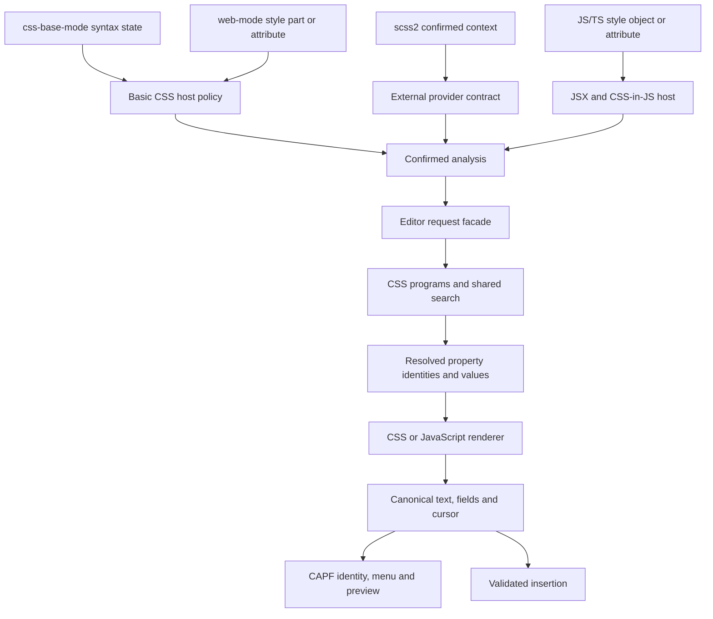

# Architecture

The package has three layers: a host confirms where an abbreviation may be
used, a pure language pipeline produces a result, and the editor presents or
inserts that result. Runtime files stay at the package root so ordinary Emacs
load paths and package recipes discover every library.

## Module groups

| Group | Modules | Responsibility |
| --- | --- | --- |
| Host entry | `emmet2-context.el` | Route to one host, validate every confirmed analysis against the restored visible view, expose the context revision. |
| Basic CSS host | `emmet2-context-css.el` | Use CSS Base syntax state and a small insertion-position policy. Also analyze bounded CSS supplied by the Web host. |
| HTML and embedded languages | `emmet2-context-web.el` | Flush web-mode scanning and route HTML, style attributes, CSS and JS parts; own its pending bounded CSS scan. |
| JSX and style objects | `emmet2-context-js.el` | Confirm JSX or CSS-in-JS objects of the configured style attributes and functions using original and projected JS trees; own those options, parser lifetimes and unit markers. |
| Extraction | `emmet2-extract.el` | Find balanced abbreviation bounds inside the host's range; recognize pseudo-chain boundaries without editor state. |
| HTML / JSX expansion | `emmet2-engine-markup.el` | Parse one markup AST, apply one HTML/React/Solid profile, then render. |
| CSS expansion | `emmet2-css.el`, `emmet2-engine-stylesheet.el` | Resolve choices, completion fragments and project rules; resolve property identities and authored values into declarations. The renderer emits CSS or JavaScript directly from those declarations. |
| Shared results and public policy | `emmet2-engine.el`, `emmet2-extensions.el` | Canonical text/field/cursor operations, deadline, engine dispatch and stable public expansion entries. |
| Data and matching | `emmet2-css-data.el`, `emmet2-css-search.el`, `emmet2-fuzzy.el` | Documented CSS names/values, abbreviation ranking, and general name matching/highlighting. |
| Semantic completion | `emmet2-completion.el`, `emmet2-css-value.el` | Shared name tables, fuzzy styles and function acceptance; adapt CSS Base value context to that shared path. |
| Editor requests | `emmet2-expand.el` | Own the expansion options and translate host analysis plus buffer layout into language requests. |
| Editor | `emmet2-mode.el`, `emmet2-capf.el`, `emmet2-preview.el`, `emmet2-insert.el` | Compose the package, own completion revisions, show previews, and accept results atomically. |
| Optional Corfu adapter | `emmet2-corfu.el` | For the `emmet2` category only, advise Corfu's row formatting, popup anchor and exactness check; installed when CAPF first offers a table and removed on unload. |

## CSS entry paths

`scss2` owns its parser, dialect, scope and semantic completion dispatcher.
Its provider's decline is final: Emmet never falls back to the basic CSS host.
Both abbreviation entry paths call the same CSS choices and expansion code.
`scss2-expand` may intentionally insert a synchronous result; that is host
policy, not a second parser or renderer.

CSS owns balanced completion-fragment splitting, pending separators and the
separator used to join declaration results. It returns full results with explicit
fragment labels and matching queries. A resolved property is never serialized
back to an abbreviation for internal expansion, and JavaScript never reparses CSS
output. Property choices never pass through the string-choice API, which serves
external callers and selector and at-rule names.

CAPF owns automatic-request confidence, input revisions, fresh candidate identities
and presentation. A small per-language confidence policy decides which automatic
requests offer choices; language modules own construction of the accepted choices. Each buffer
retains only its latest opaque language batch. Admission probes and table refreshes
share that batch for unchanged input, host and render settings, while each table
receives fresh candidate identities. CSS owns reuse across edits and confirmed-prefix
semantics. CAPF neither parses CSS output nor reads splitter/search-index internals.
An input interruption preserves a retryable table; errors and explicit quits
invalidate it. Input revisions and completed choices are published atomically,
so a cancelled computation cannot leave a partial revision or an empty-result
sentinel behind. Preview and acceptance still require current source and choices.
Metadata queries use the search module's value-name and membership APIs, sharing
its pinned catalog.

Semantic completion is a different request. `emmet2-css-data-query` returns
property/value names and metadata for a host to combine with Sass symbols.
`emmet2-completion-capf` owns their shared table protocol, spelling-aware
matching and initial function cursor placement. It creates no snippet fields;
subsequent navigation belongs to the host. CSS Base supplies value bounds through
`emmet2-context-css-value`; scss2 supplies its own parsed context and identity
rules. Both call the same data and completion modules. The native adapter
declines external-provider buffers, and scss2 keeps its single dispatcher.
Hosts may defer candidate discovery until the table is actually queried. A table
retains one completed result; admission probes do not collect symbols or read
modules, and a new session discovers them again without a project-wide cache.
It does not expand a declaration. General fuzzy matching and compact CSS
abbreviation ranking retain their separate contracts.

Pseudo expansion produces selector names and editable function arguments only.
It does not create rule bodies or declarations, so hosts need no rule-body
permission or following-block checks.

## Position and completion policy

Basic CSS support uses `syntax-ppss` from CSS Base, without another CSS parser.
It permits property abbreviations only at declaration starts, excludes values,
comments, strings and arguments, and limits stylesheet-root expansion to
at-rules and pseudo selectors. A comment between declarations or a completed
nested block before point does not change the declaration-start position.
Embedded CSS needs a bounded
lexical parse because web-mode's buffer syntax is not CSS syntax.

`emmet2-complete` requests the same CAPF and admission rules as automatic
completion in built-in CSS. It neither selects a candidate nor changes the
frontend's settings. The frontend owns popup behavior, prefix thresholds and
sole-match acceptance; the optional Corfu adapter keeps a sole Emmet choice in
the popup. Markup in other major modes, cold JSX initialization and external
hosts use explicit requests, so they need `emmet2-complete`. The command
delegates analysis and grammar initialization to CAPF once; there is no separate
analysis preflight. `emmet2-expand-at-point` uses the same explicit analysis and
inserts the first expansion through `emmet2-insert`, without a frontend.

## Resource and write ownership

- The JSX adapter owns original/projection parser tags, one idle timer and
  bounded unit markers per buffer view. Its hooks invalidate and release only
  those resources.
- The Web adapter owns one pending scan extent with edit evidence. A mismatch
  discards that extent and lets web-mode perform its normal scan. It owns no
  parser and does not share cleanup with the JSX adapter. Its region entry scans
  on its own.
- The context entry coordinates start/stop and exposes analysis inputs; it
  stores no second parser inventory or analysis cache.
- Search loads the pinned index and CSS overrides once. Expansion reads the
  same immutable override catalog. ASTs and search scratch tables are call-local.
- A completion table keeps immutable input revisions and candidate identities.
  Display never advances a revision; acceptance rejects stale or foreign choices.
  The buffer keeps only the last choice batch, checked against the source
  revision, provider and render settings before reuse and discarded on
  major-mode changes.
- `emmet2-insert` is the only source writer. Preview and parsing are read-only.
  Accepted text and markup snippet fields enter one atomic undo group.

## Request and failure boundaries

`emmet2-mode` registers completion and starts/stops host resources.
`emmet2-expand` reads project options and buffer layout; it is an editor facade,
not a pure engine. CAPF can load independently of the minor mode. String expansion
remains buffer-independent through `emmet2-extensions` and the native engines.

Each completion entry and delayed completion callback shares the same failure
policy. Automatic failures return no choice and invalidate the table. Explicit
requests and acceptance report the cause. An explicit quit propagates and
invalidates the table, while an interruption by new input leaves it retryable;
`debug-on-error` still reaches the original error. Pure APIs signal typed
failures.

Both host callbacks restore point, narrowing and match data. One validation path
checks the original visible range and language/position/indentation contract.
The Web adapter owns part language, exclusive endpoints and file/style dialect;
JS warmup consumes the same region discovery as ordinary analysis.
